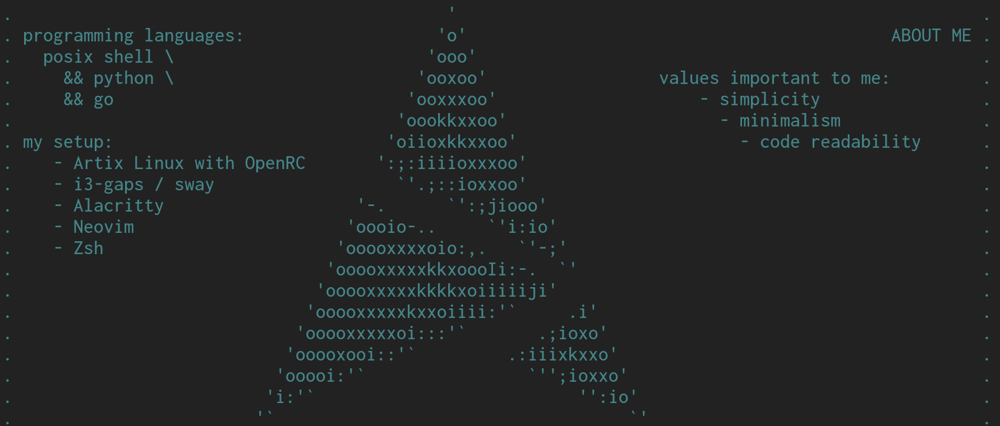

For more info about my setup, visit [alexcoder04.github.io/in-finit-y](https://alexcoder04.github.io/in-finit-y/)

This awesome statistics is generated with [jstrieb/github-stats](https://github.com/jstrieb/github-stats).

